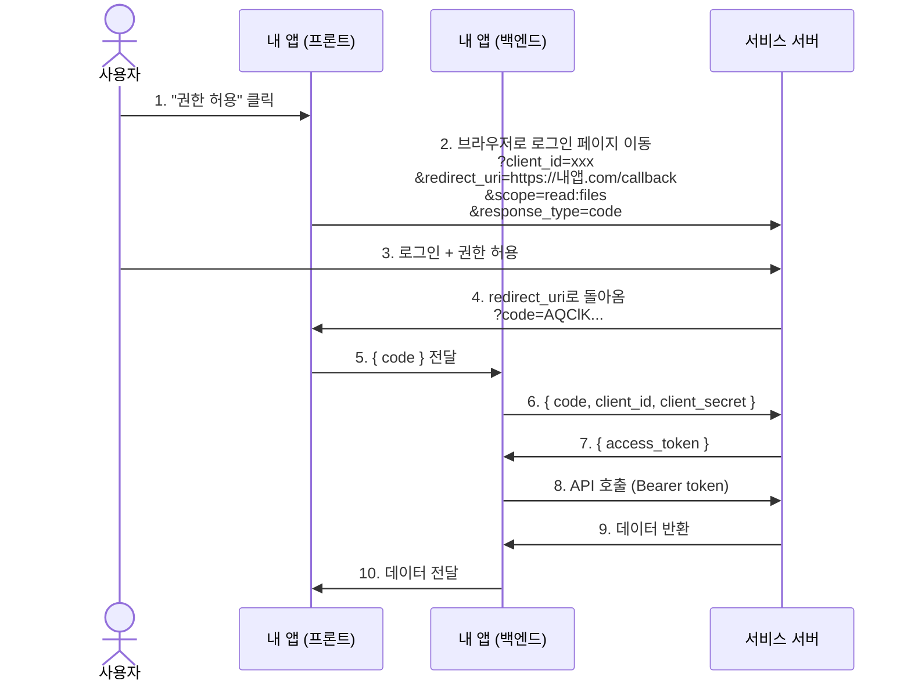

# OAuth 2.0 Authorization Code Flow

## OAuth가 뭔가

"내 비밀번호를 알려주지 않고, 내 데이터에 접근할 수 있는 권한만 위임하는 프로토콜"

예: "내 Google Drive 파일을 Notion이 읽게 해줘" — 이때 Notion에게 Google 비밀번호를 주지 않아도 됨

---

## 나오는 단어들

| 용어                     | 역할                               | 예시                 |
| ------------------------ | ---------------------------------- | -------------------- |
| **Resource Owner**       | 데이터의 주인. 사용자.             | 나                   |
| **Client**               | 데이터에 접근하려는 앱             | Notion, 내가 만든 앱 |
| **Authorization Server** | 로그인 + 권한 허용을 처리하는 서버 | Google 계정 서버     |
| **Resource Server**      | 실제 데이터를 갖고 있는 서버       | Google Drive API     |
| **Access Token**         | 데이터 접근 증명서. 유효기간 있음  | `ya29.a0Af...`       |
| **Authorization Code**   | access token으로 교환할 1회용 코드 | `4/0AY0e-g7...`      |

> Authorization Server와 Resource Server는 같은 회사의 서버인 경우가 많지만 역할이 다름

---

## Authorization Code Flow (표준 흐름)

## 왜 code → token 교환을 백엔드에서 하나

**code는 URL에 노출된다.** 브라우저 주소창, 히스토리, 서버 로그에 남을 수 있음.
code 자체는 1회용이라 노출돼도 단독으론 쓸모없음. 하지만 token으로 교환하려면 **App Secret**이 필요하다.
App Secret을 프론트엔드(브라우저/앱 번들)에 두면 누구나 꺼낼 수 있음.
→ 그래서 App Secret은 서버에만 보관하고, code → token 교환도 서버에서 처리.
프론트가 직접 하면 ❌
프론트 → 서비스 서버: { code, client_id, client_secret }
client_secret이 번들에 하드코딩 → 누구나 꺼낼 수 있음

백엔드 경유 ✅
프론트 → 내 백엔드: { code }
내 백엔드 → 서비스 서버: { code, client_id, client_secret }
client_secret은 서버 환경변수에만 존재

---

## Redirect URI 란

OAuth 인증이 끝난 뒤 code를 받을 URL.

- 서비스 서버에 **미리 등록**해둬야 함
- 실제 요청의 redirect_uri가 등록값과 **정확히 일치**해야 함 (보안 장치)
- 불일치 시 서비스 서버가 요청 거부

## OAuth vs SSO

헷갈리기 쉬운 개념.
| | OAuth | SSO |
|---|---|---|
| **목적** | 권한 위임 (데이터 접근) | 인증 통합 (로그인) |
| **예시** | "내 Drive 파일 읽기 권한을 Notion에게" | "Google 계정으로 Notion에 로그인" |
| **내 서비스 계정** | 별도 존재, OAuth는 데이터 접근만 | OAuth 계정이 곧 내 서비스 계정 |
| **토큰 저장** | 필요한 동안만 / 폐기 가능 | 세션 유지 목적으로 저장 |

> SSO(Single Sign-On)는 보통 OAuth 위에 OpenID Connect를 얹어서 구현함

> "Google로 로그인" = OAuth(권한 위임) + OpenID Connect(신원 확인)

## OAuth만 쓰는 경우: "일시적으로 데이터 접근 권한만 빌리기" (비밀번호를 알 필요 없음)

## Token 종류

| 종류                         | 유효기간      | 용도                                     |
| ---------------------------- | ------------- | ---------------------------------------- |
| **Authorization Code**       | 수 분 (1회용) | access token으로 교환하기 위한 임시 코드 |
| **Short-lived Access Token** | 수 시간~1일   | API 호출에 사용                          |
| **Long-lived Access Token**  | 수십~수백일   | 재로그인 없이 장기 사용                  |
| **Refresh Token**            | 수개월~무기한 | access token 만료 시 재발급 요청         |

> 서비스마다 제공하는 token 종류가 다름. Refresh Token을 안 주는 서비스도 있음.

---

## Scope란

권한의 범위. "어디까지 허용할 것인가"를 명시.
scope=read:email # 이메일 읽기만
scope=read:files # 파일 읽기만
scope=read:files write:files # 파일 읽기 + 쓰기

## 사용자는 권한 허용 화면에서 scope 목록을 보고 승인. 요청한 scope만 부여됨.

## 정리: 흐름 한 줄 요약

사용자가 서비스에 로그인 → 내 앱에 권한 허용
→ code 발급 (URL로 전달)
→ 내 백엔드가 code + secret으로 token 교환
→ token으로 API 호출
→ 데이터 획득

App Secret은 절대 프론트에 두지 않는다. code → token 교환은 항상 서버에서.
