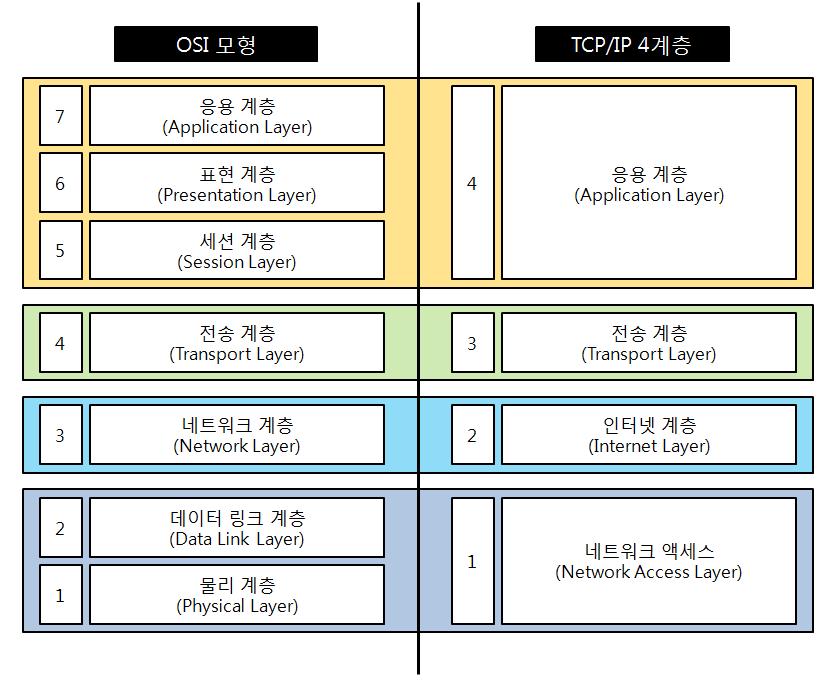

TCP/IP 4계층과 OSI 7계층의 차이

TCP/IP계층과 달리 OSI 계층은 애플리케이션 계층을 세 개로 쪼개고,
링크 계층을 데이터 링크 계층과 물리 계층으로 나눠서 표현하는 것이 다르며,
인터넷 계층을 네트워크 계층으로 부른다

특정 계층이 변경되었을 때 다 계층이 영향을 받지 않도록 설계되었다.

## TCP/IP 4계층

Transmission Control Protocol/Internet Protocol
현재의 인터넷에서 컴퓨터들이 서로 정보를 주고받는데 쓰이는 프로토콜의 모음
